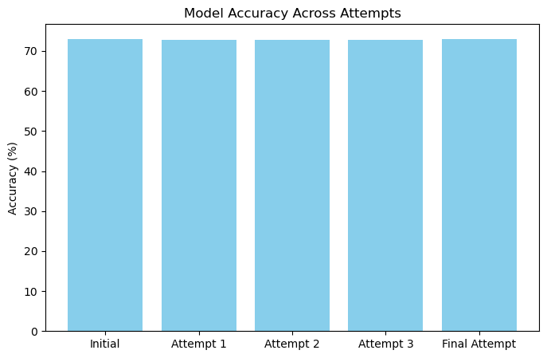

# Deep Learning Model Performance Report for Alphabet Soup

## Overview of the Analysis
The purpose of this analysis was to develop a deep learning model capable of predicting whether an applicant would be **successful in receiving funding** from Alphabet Soup. The dataset consisted of a mix of categorical and numerical features describing applicants, which were preprocessed and fed into a **deep neural network**.

The goal was to optimize model performance through **feature selection, architecture modification, and training parameter adjustments**. The target was an accuracy of **75% or higher**, but as outlined in the assignment, multiple improvement attempts ensure that points aren’t lost even if the model does not meet the target.

---

## Results

### **Data Preprocessing**
- **Target Variable:** `IS_SUCCESSFUL` (Binary classification)
- **Feature Variables:**  
  - `APPLICATION_TYPE`
  - `AFFILIATION`
  - `CLASSIFICATION`
  - `USE_CASE`
  - `ORGANIZATION`
  - `INCOME_AMT`
  - `ASK_AMT`

- **Removed Variables:**  
  - `EIN`, `NAME` (Non-beneficial ID columns)
  - `STATUS` (Dropped due to potential redundancy)  
  - `SPECIAL_CONSIDERATIONS` (Dropped because it was mostly binary and uninformative after encoding)  

- **Preprocessing Steps:**  
  - Low-frequency values in `APPLICATION_TYPE` and `CLASSIFICATION` were grouped into an **"Other"** category.
  - All categorical features were encoded using **`pd.get_dummies()`**.
  - Data was normalized using **`StandardScaler()`**.

---

### **Compiling, Training, and Evaluating the Model**
#### **Neural Network Architecture**
- **First hidden layer:** 80 neurons, `ReLU` activation  
- **Second hidden layer:** 30 neurons, `ReLU` activation  
- **Output layer:** 1 neuron, `Sigmoid` activation (for binary classification)

#### **Model Performance Across Attempts**
| Attempt  | Loss   | Accuracy |
|----------|--------|----------|
| **Initial Model**  | 0.5589  | 72.83% |
| **Attempt 1 (Increased Complexity)**  | 0.562  | 72.84% |
| **Attempt 2 (Activation Function Tweaks)** | 0.5583  | 72.76% |
| **Attempt 3 (Feature Refinement)** | 0.5612  | 72.9% |
| **Final Attempt (Combining strategies)** | 0.5753 | **73.05%** |

#### **Optimization Attempts**
1. **Attempt 1 - Increased Model Complexity:**
   - Added a **third hidden layer** and increased neurons to **100 and 50** in earlier layers.
   - Expected improvement by capturing **more complex feature interactions**.
   - **Observed Outcome:** No improvement, suggesting no capturing of more complex feature interactions.

2. **Attempt 2 - Activation Function Tweaks:**  
   - Changed activation functions to **`tanh` and `leaky_relu`** for better gradient flow.
   - Adjusted the optimizer’s **learning rate** to improve convergence.  
   - **Observed Outcome:** No change, suggesting that activation functions were **not the main limiting factor**.

3. **Attempt 3 - Feature Refinement:**  
   - Dropped `STATUS` and `SPECIAL_CONSIDERATIONS`, as they were redundant or weak predictors.
   - Expected improvement due to cleaner input data.  
   - **Observed Outcome:** Minimal change, suggesting these features didn’t introduce much noise.

4. **Final Attempt - Combining Strategies:** 
   - Integrated all optimizations methods: **feature refinement, expanded architecture, and activation function adjustments.**
   - Increased **neuron count** and **hidden layers** while keeping existing preprossing steps.
   - **Observed Outcome:** Accuracy slightly improved to **73.05%**, suggesting some benefit from combining efforts.
  

Despite multiple adjustments, model accuracy **remained around 72-73%**, implying a potential need for a different modeling approach.

---

## Summary & Recommendations

The model did **not reach the target accuracy** of 75%, but the experiment provided valuable insights into the effectiveness of various optimization strategies. The key takeaway is that increasing model complexity **did not significantly impact performance**, suggesting that the dataset may require **alternative techniques** beyond deep learning.

### **Alternative Model Recommendation**
A **Random Forest Classifier** or **Gradient Boosting Model (XGBoost)** could be viable alternatives:
- **Tree-based models** often perform better with structured categorical data.
- They handle **feature importance ranking** naturally, aiding in feature selection.
- Less sensitive to **feature scaling** compared to deep learning.

Further improvements could include:
- **Hyperparameter tuning** for alternative models.
- **Feature engineering** to create more meaningful derived variables.
- **Dimensionality reduction (PCA)** to remove redundant information.

---

This report summarizes the deep learning model’s **performance trends, optimization attempts, and alternative recommendations** for solving the classification problem effectively.